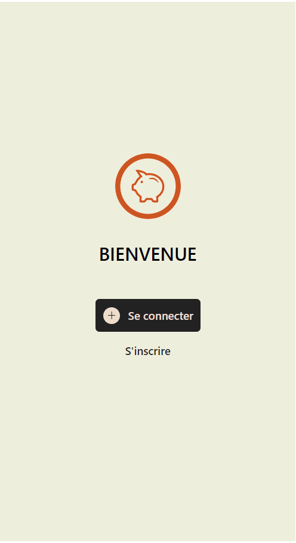

# 💰 My_bank | AngularJS Java-Spring boot💰
  
Application bancaire, prise en main Angular + Spring boot

`To start the project :`  
```
Clone the repository

Front end folder :
npm install
ng serve

Back end folder :
Install all dependency to use Java and spring with VScode
Run the server from the main file
```
<p align="center">
    
</p>
